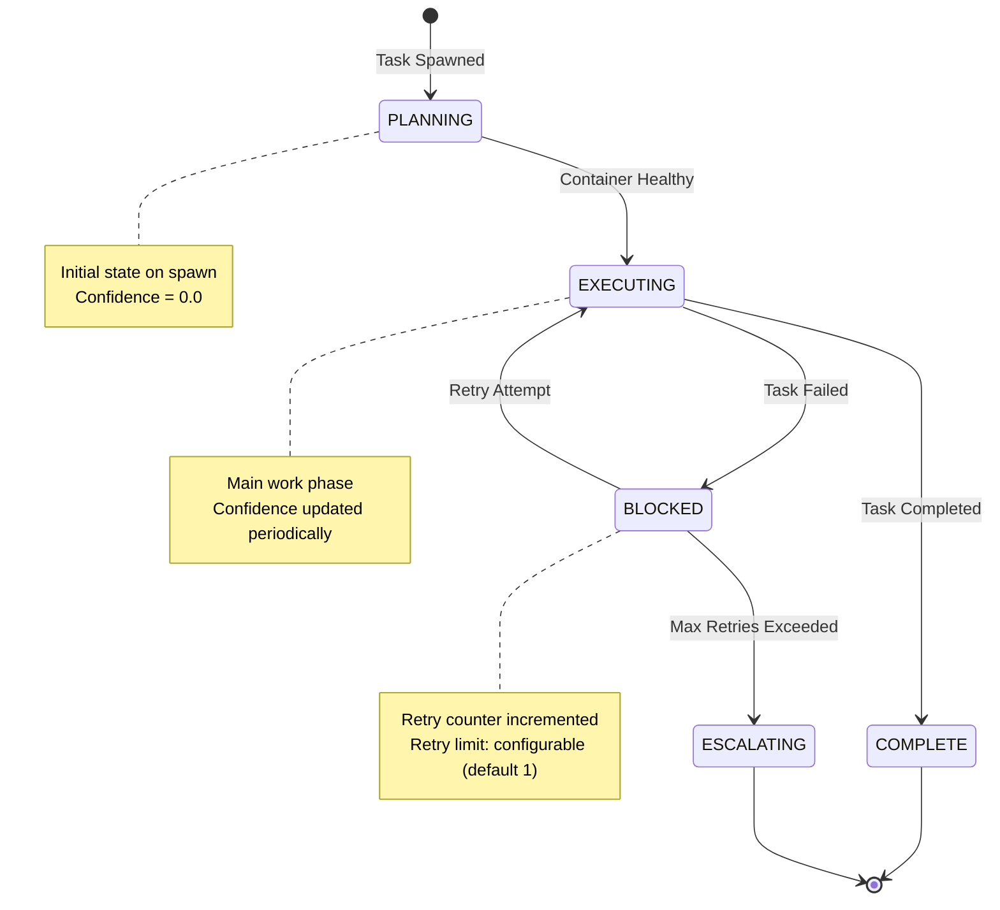
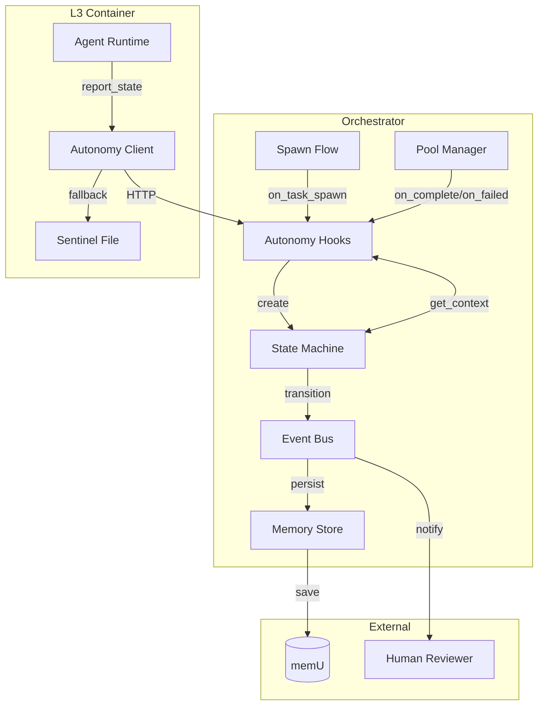
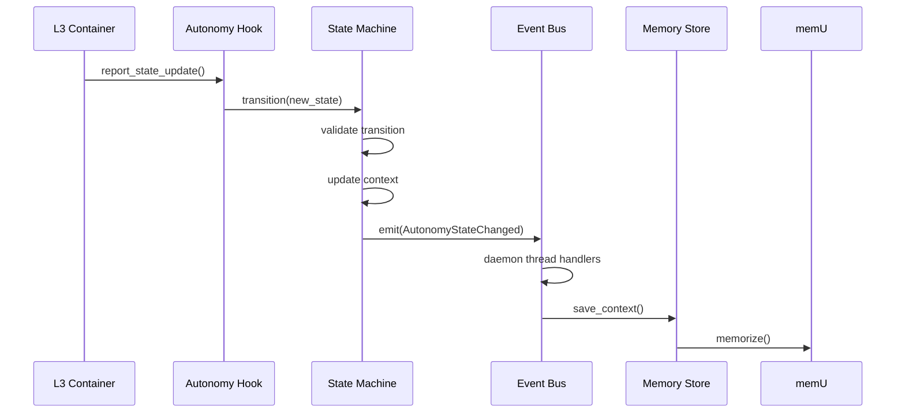

# OpenClaw Agent Autonomy Framework - Design Document

## Overview

The Agent Autonomy Framework enables L3 containers to self-direct their work with confidence-based decision making. This document describes the architecture, state machine, integration patterns, and operational considerations.

**Scope**: Task-level autonomy within a single L3 container execution. Escalation to human oversight when confidence falls below threshold.

---

## 1. State Machine

### 1.1 States

The framework defines 4 core states:

| State | Description | Entry Trigger |
|-------|-------------|---------------|
| **PLANNING** | Task initialized, container starting | `on_task_spawn()` called |
| **EXECUTING** | Container healthy, work in progress | Container health check passes |
| **BLOCKED** | Task hit an obstacle, retry pending | Task failure with retries remaining |
| **COMPLETE** | Task finished successfully | Task completion signal |
| **ESCALATING** | Max retries exceeded, human needed | Task failure, no retries left |

### 1.2 State Diagram (Mermaid)



### 1.3 Transitions

| From | To | Condition | Retry Count |
|------|-----|-----------|-------------|
| PLANNING | EXECUTING | Container health check | - |
| EXECUTING | BLOCKED | Task failure, can_retry=True | unchanged |
| EXECUTING | COMPLETE | Success signal | - |
| BLOCKED | EXECUTING | Automatic retry | +1 |
| BLOCKED | ESCALATING | retry_count >= max_retries | - |

### 1.4 Terminal States

- **COMPLETE**: Task achieved its objective. Context archived to memU.
- **ESCALATING**: Task requires human intervention. Context preserved, human notified.

---

## 2. Confidence Scoring

### 2.1 ConfidenceScorer Protocol

```python
class ConfidenceScorer(Protocol):
    def score(self, context: dict) -> float: ...  # Returns 0.0-1.0
```

### 2.2 ThresholdBasedScorer (Default)

Uses weighted heuristics based on task characteristics:

| Factor | Weight | Calculation |
|--------|--------|-------------|
| Complexity | 0.25 | Keyword analysis (architecture, database, async, etc.) |
| Ambiguity | 0.30 | Uncertainty words vs. clarity indicators |
| Past Success | 0.25 | Historical success rate (stub: 0.5 neutral) |
| Time Estimate | 0.20 | Duration-based (1h=0.9, 40h+=0.1) |

**Formula**: `score = (1-complexity)*0.25 + (1-ambiguity)*0.30 + past_success*0.25 + time*0.20`

### 2.3 AdaptiveScorer (Future)

Placeholder for ML-based scoring using historical task outcomes.

### 2.4 Escalation Threshold

Default: **0.6**

Tasks with confidence < 0.6 trigger escalation protocols:
1. L3 container reports low confidence via HTTP
2. Event emitted: `autonomy.escalation_triggered`
3. Human reviewer notified via existing notification channels

---

## 3. Architecture

### 3.1 Component Diagram



### 3.2 Module Organization

```
openclaw/autonomy/
├── __init__.py          # Public API exports
├── types.py             # AutonomyState, AutonomyContext, StateTransition
├── state.py             # StateMachine implementation
├── confidence.py        # ConfidenceScorer protocol and implementations
├── events.py            # Event types and AutonomyEventBus
├── hooks.py             # Spawn flow integration hooks
├── autonomy_client.py   # L3 HTTP client with sentinel backup
├── memory.py            # memU persistence (AutonomyMemoryStore)
└── reporter.py          # Legacy reporting (Phase 54-02)
```

---

## 4. Integration Patterns

### 4.1 Spawn Flow Integration

Hook call sites in task lifecycle:

```python
# 1. Task spawn - create context
task_id = pool.spawn(task_spec)
context = on_task_spawn(task_id, task_spec)

# 2. Container health check - start executing
def on_health_check(task_id):
    if is_healthy(task_id):
        on_container_healthy(task_id)

# 3. Task completion
pool.on_complete(task_id, result)
on_task_complete(task_id, result)

# 4. Task failure
pool.on_failure(task_id, error)
on_task_failed(task_id, error)

# 5. Cleanup
pool.remove(task_id)
on_task_removed(task_id, archive=True)
```

### 4.2 Event Flow



### 4.3 Data Flow

| Phase | Action | Persistence |
|-------|--------|-------------|
| Spawn | Create `AutonomyContext` | In-memory store |
| Health | Transition to EXECUTING | Event emitted, memU optional |
| Confidence Update | Score calculated | Debounced event, memU backup |
| Failure | Retry or escalate | State + history to memU |
| Complete | Terminal state | Full context archived |
| Removal | Cleanup | Archive to memU |

---

## 5. L3 Self-Reporting Protocol

### 5.1 HTTP API

**Base URL**: `http://host.docker.internal:8080/api/v1/autonomy`

| Endpoint | Method | Description |
|----------|--------|-------------|
| `/state` | POST | Report state update |
| `/escalate` | POST | Request human escalation |
| `/state/{task_id}` | GET | Get current state |

### 5.2 State Update Payload

```json
{
  "task_id": "task-123",
  "state": "executing",
  "confidence": 0.85,
  "timestamp": 1708800000.0,
  "metadata": {
    "progress_percent": 50,
    "current_step": "Implementing core logic"
  }
}
```

### 5.3 Sentinel Files

**Location**: `/tmp/openclaw/autonomy/{task_id}.json`

Sentinel files serve as local backup when HTTP is unavailable:

```json
{
  "version": "1.0",
  "task_id": "task-123",
  "timestamp": 1708800000.0,
  "data": {
    "state": "executing",
    "confidence": 0.85,
    ...
  }
}
```

**Recovery**: On orchestrator restart, scan sentinel directory and load contexts.

### 5.4 Retry Strategy

- Max retries: 3
- Base delay: 1s
- Exponential backoff: 1s, 2s, 4s
- Timeout: 5s per request
- Fall back to sentinel file after all retries fail

---

## 6. memU Integration

### 6.1 Memory Category

All autonomy contexts stored with `category="AUTONOMY_STATE"`

### 6.2 Metadata Schema

| Field | Type | Description |
|-------|------|-------------|
| `task_id` | string | Task identifier |
| `project` | string | Project name |
| `state` | string | Current state value |
| `timestamp` | ISO8601 | Last update time |
| `archived` | boolean | True if terminal state |

### 6.3 Query Patterns

```python
# Active tasks for project
AutonomyMemoryStore.query(project="myapp", archived=False)

# Completed tasks this week
AutonomyMemoryStore.query(
    state="complete",
    archived=True,
    since=datetime.utcnow() - timedelta(days=7)
)

# Task history (all state changes)
AutonomyMemoryStore.get_task_history("task-123")
```

---

## 7. Decision Log

### 7.1 Why 4 States?

- **PLANNING**: Distinguishes initialization from execution. Allows pre-flight checks.
- **EXECUTING**: Clear "work in progress" signal. Confidence updates meaningful here.
- **BLOCKED**: Explicit retry state. Prevents false "in progress" signals.
- **COMPLETE/ESCALATING**: Terminal states enable proper cleanup and archival.

Rejected alternatives:
- 3-state (merge BLOCKED into EXECUTING) → Lost retry visibility
- 5+ states (add PAUSED, CANCELLED) → Over-complicated for v1

### 7.2 Why 0.6 Threshold?

- 0.5 is neutral coin-flip — too aggressive
- 0.7 catches too many viable tasks — creates noise
- 0.6 balances caution with throughput
- Configurable per-project for tuning

### 7.3 Why 1 Retry Default?

- 0 retries: Transient failures escalate unnecessarily
- 2+ retries: Long retry loops block pool resources
- 1 retry: Catches ~70% of transient issues per industry data

### 7.4 Why Sentinel Files?

- memU may be unavailable (network, service down)
- HTTP may fail (orchestrator restart, network partition)
- Local files are always available within container
- JSON format enables manual recovery if needed

### 7.5 Why Event Debouncing?

- Confidence scores update frequently (every tool call could affect it)
- High-frequency events flood event bus and downstream handlers
- 5-second debounce captures meaningful changes while reducing noise
- 0.1 score threshold handles significant jumps immediately

---

## 8. Operational Considerations

### 8.1 Monitoring

| Metric | Source | Alert Threshold |
|--------|--------|-----------------|
| Escalation rate | Event bus | >20% of tasks |
| Retry success rate | memU query | <50% of retries |
| Confidence avg | memU query | <0.5 for project |
| Event lag | Event bus | Handlers delayed >30s |

### 8.2 Troubleshooting

**Issue**: High escalation rate
- Check: Task specifications too vague?
- Check: Confidence calibration off?
- Action: Adjust `escalation_threshold` or improve task specs

**Issue**: L3 containers not reporting
- Check: `OPENCLAW_TASK_ID` env var set?
- Check: Network access to host.docker.internal:8080?
- Check: Sentinel files exist in `/tmp/openclaw/autonomy/`?

**Issue**: Events not persisting to memU
- Check: memU service healthy?
- Check: `openclaw.memorize` importable?
- Action: Verify sentinel files as backup

### 8.3 Rollback Plan

If autonomy framework causes issues:

1. Disable via config: set `autonomy.enabled: false` in openclaw.json
2. Remove hooks from spawn flow (revert to pre-54 spawn.py)
3. Clear event bus handlers: `event_bus.clear_handlers()`
4. Archived contexts remain in memU for audit trail

---

## 9. Future Work

- **AdaptiveScorer ML implementation**: Learn from actual outcomes
- **Cross-task confidence**: Factor in related task success rates
- **Proactive escalation**: Predict failure before blocked state
- **Human feedback loop**: Capture human resolution patterns
- **Multi-agent coordination**: Confidence for distributed tasks

---

## 10. References

- `54-01-PLAN.md` - State machine implementation
- `54-02-PLAN.md` - Confidence and configuration
- `54-03-PLAN.md` - Integration hooks
- `54-04-SUMMARY.md` - This implementation summary
- `packages/orchestration/src/openclaw/autonomy/` - Source code

---

**Status**: Approved for implementation  
**Version**: 1.0  
**Updated**: 2026-02-25
